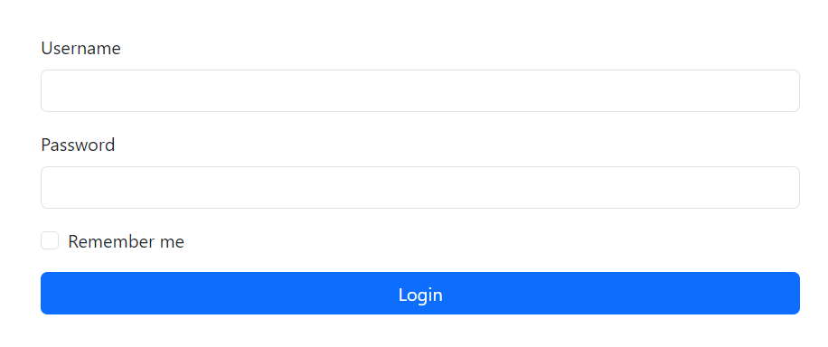
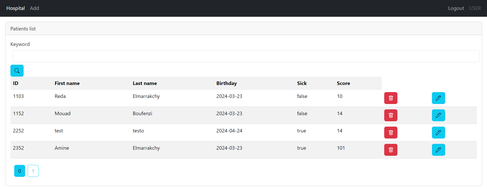
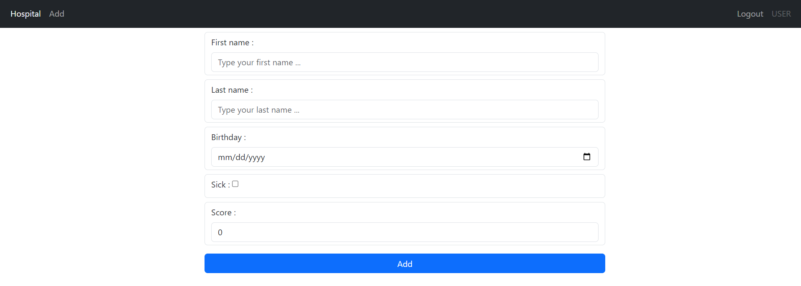
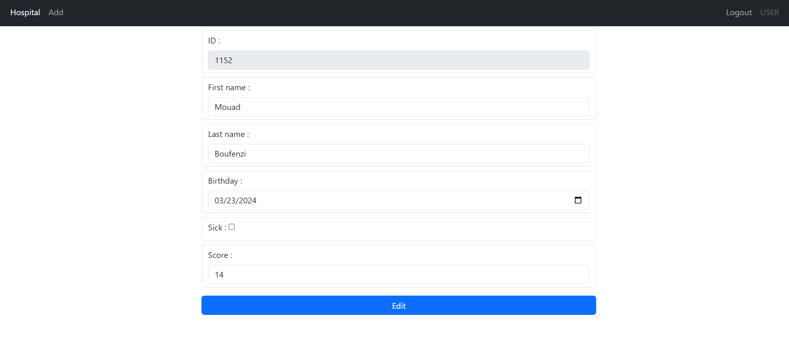
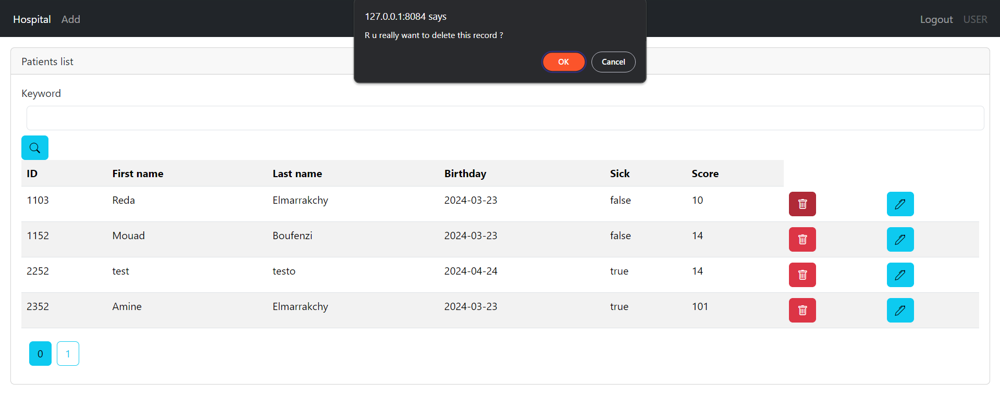
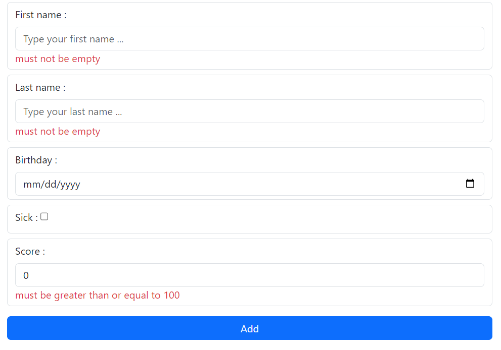
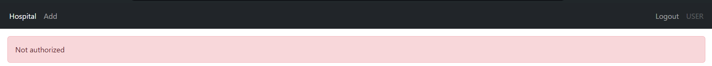

# PW 3 - PATIENTS MANAGEMENT | AUTHOR : ELMARRAKCHY Reda

## Description of the assignment :
The goal of this assignment is to implement my knowledge in the Spring Boot framework in a real-world case, which is a patient management app using mySQL database.
This app contains two users with two roles: USER and ADMIN.

- The USER role can only consult data of patients.
- The ADMIN role can manage the data of patients.

## APIs :

| Method | Endpoint           | Description                      |
|--------|--------------------|----------------------------------|
| GET    | /                  | Redirect to /user/index          |
| GET    | /login             | Access to login page             |
| GET    | /user/index        | Access to home page              |
| GET    | /admin/formPatient | Access to add patient page       |
| GET    | /admin/edit        | Access to edit patient data page |
| POST   | /admin/delete      | Delete a patient record          |
| POST   | /admin/save        | Add a new patient                |
| POST   | /admin/edit        | Edit a patient record            |
| POST   | /admin/edit        | Edit a patient record            |

## Implementing security framework :

For the security framework, I choose to implement the In-Memory Authentication to provide support for username/password based authentication that is stored in memory with using Bcrypt for encryption.
```java
public InMemoryUserDetailsManager inMemoryUserDetailsManager(PasswordEncoder passwordEncoder){
        String encodedPassword = passwordEncoder.encode("----");
        return new InMemoryUserDetailsManager(
                User.withUsername("redar").password(encodedPassword).roles("USER").build(),
                User.withUsername("admin").password(encodedPassword).roles("USER","ADMIN").build()
        );
    }
```
Also I create a security filter chain configuration. It defines various security measures such as form login with a designated login page, remember-me functionality, and handling of access-denied scenarios. Additionally, it specifies authorization rules based on user roles, restricting access to certain endpoints to users with specific roles, while requiring authentication for other endpoints.
````java
public SecurityFilterChain securityFilterChain(HttpSecurity httpSecurity) throws Exception {
        return httpSecurity
                .formLogin(form -> form.loginPage("/login").permitAll())
                .rememberMe(r -> r.alwaysRemember(true))
                .exceptionHandling(ex -> ex.accessDeniedPage("/404"))
                .authorizeHttpRequests(ar->ar.requestMatchers("/deletePatient/**").hasRole("ADMIN"))
                .authorizeHttpRequests(ar->ar.requestMatchers("/admin/**").hasRole("ADMIN"))
                .authorizeHttpRequests(ar->ar.requestMatchers("/user/**").hasRole("USER"))
                .authorizeHttpRequests(ar -> ar.requestMatchers("/webjars/**"))
                .authorizeHttpRequests(ar->ar.anyRequest().authenticated())
                .build();
    }
````

## Data validation :
It's crucial to check if the user inputs are valid before storing them in our database, and for that, I use the `spring-boot-starter-validation` dependency.
```java
public class Patient {
    @Id @GeneratedValue(strategy = GenerationType.AUTO)
    private Long id;
    @NotEmpty
    private String fn;
    @NotEmpty
    private String ln;
    @Temporal(TemporalType.DATE)
    @DateTimeFormat(pattern = "yyyy-MM-dd")
    private Date birthday;
    private boolean sick;
    @DecimalMin("100")
    private int score;
}
```

## Demo :
<p align="center">
    
    <br />
    <em>Login page</em>
</p>
<p align="center">
    
    <br />
    <em>Home page</em>
</p>
<p align="center">
    
    <br />
    <em>Adding a new patient's data</em>
</p>
<p align="center">
    
    <br />
    <em>Editing a record</em>
</p>
<p align="center">
    
    <br />
    <em>Deleting a record</em>
</p>
<p align="center">
    
    <br />
    <em>Validation errors</em>
</p>
<p align="center">
    
    <br />
    <em>Access denied</em>
</p>
